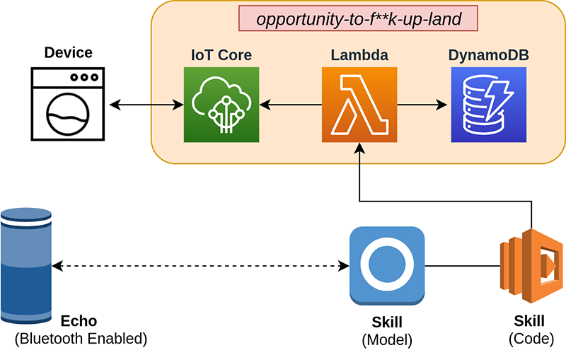
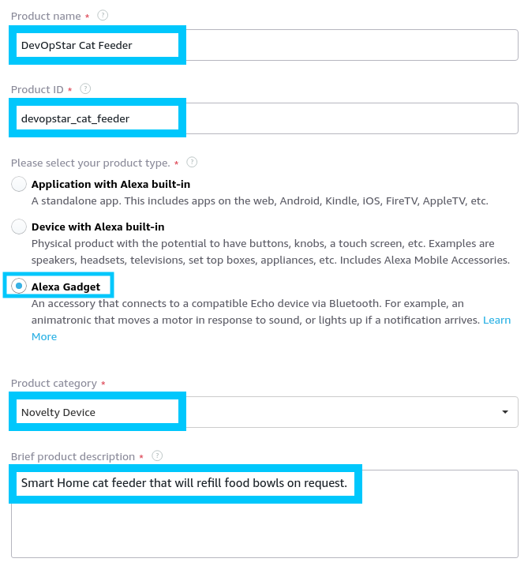
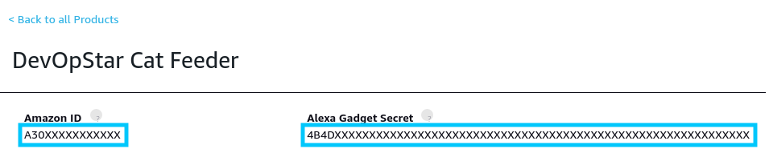

# Alexa Gadget - Cat Feeder

When [Amazon Alexa](https://alexa.amazon.com) launched in 2014 as the first major home assistant platform I was captivated by the opportunities it offered someone like me. Clearly I wasn't alone either as over the coming years we saw a boom of new generation electronics incorporating virtual assistants in their sales pitch.

Now having voice assistant support is almost a must when launching any kind of home appliance, however this consumer demand is beginning to force hardware manufacturers to operate in a space that is very new and full of bad actors. Not all companies are technology first, so when their teams are asked to equip their white goods with internet capabilities there is a lot of room for error. **This is why I believe Amazon Alexa Gadgets are a really big deal**.

By the end of this article you will have everything you need to build your own gadget by using source code I've provided to build this simple Alexa powered cat feeder.

<blockquote class="twitter-tweet"><p lang="en" dir="ltr">Alexa cat feeder.<br><br>A prototype that really shouldn&#39;t exist, and yet here we are <a href="https://twitter.com/hashtag/alexa?src=hash&amp;ref_src=twsrc%5Etfw">#alexa</a> <a href="https://twitter.com/hashtag/aws?src=hash&amp;ref_src=twsrc%5Etfw">#aws</a> <a href="https://twitter.com/hashtag/awscloud?src=hash&amp;ref_src=twsrc%5Etfw">#awscloud</a> <a href="https://twitter.com/hashtag/catfeeder?src=hash&amp;ref_src=twsrc%5Etfw">#catfeeder</a> <a href="https://twitter.com/hashtag/iot?src=hash&amp;ref_src=twsrc%5Etfw">#iot</a> <a href="https://t.co/xHEp2lyfVC">pic.twitter.com/xHEp2lyfVC</a></p>&mdash; Nathan Glover (@nathangloverAUS) <a href="https://twitter.com/nathangloverAUS/status/1218760354181730304?ref_src=twsrc%5Etfw">January 19, 2020</a></blockquote>

---

## What is a Gadget

---

To understand the difference between an Amazon Alexa supported device, and an Alexa Gadget, you should first understand how most companies would approach building a smart assistant enabled device currently.



The architecture above is what you would usually see if the goal was to simply incorporate home assistant functionality.

1. Device registered, associated with a user. Stored in DynamoDB.
2. Call made to Alexa skill service.
3. Skill calls out to Lambda providing a unique identifier to lookup what device should have what actions performed.
4. Device is controlled over MQTT.

The problem with this architecture is it relies on understanding a number of (potentially very new) services to tie everything together. While there is nothing inherently wrong with the design, it leaves room for error.

Alexa Gadgets on the other-hand are meant as simple companions to exist Alexa devices.


If the goal for your product is to simply give it Alexa support then the design above is both simpler and less prone to security holes.

1. Device is paired with Echo (or any other Alexa bluetooth device).
2. Device receives events over Bluetooth messages when skills are invoked.
3. Device can react & respond through the Alexa device.

---

## Building a Gadget

---

So you want to learn how to build a gadget? Well hopefully I can help demystify the process for you while we build something fun! We will be building an Alexa controlled cat feeder that is going to be controlled entirely through the Alexa Gadget interface.

### Content

---

* Alexa Gadget **Product Creation**
* Alexa Gadget **Device Setup & Registration**
* **Gadget Code** Overview
* Cat Feeder **Gadget Code**
* Cat Feeder **Alexa Skill Deployment**
* **Electronics Setup** [Optional]

### Requirements

---

* **Raspberry Pi 3 B+**: or another bluetooth microcontroller.
* **AWS Account**: [Create one if you need one](https://console.aws.amazon.com/console/home).
* **Amazon Developer account**: [create one here](https://developer.amazon.com/alexa) if you haven't already got one.
* *Optional*:
  * **3-wire servo**: To control cat feeder opening.
  * **RGB LED**: display status when skill is in use.
  * **Assortment of wires**: too wire!

**NOTE**: *While you might need to follow all steps to get a working cat feeder, they aren't necessary if you just want to learn. You can still setup a gadget (in our case a Raspberry Pi) to receive events from Alexa!*

---

### Alexa Gadget Product Creation

---

To start with we will need to create a new Alexa Voice Service Gadget by heading over to the [products portal](https://developer.amazon.com/alexa/console/avs/products). Click **Create Product** to begin.


Next you will be prompted to fill out a bunch of details about your new product. In our case we use the following details, however for your scenario feel free to change it up.

***NOTE**: The important piece of info is you MUST select Alexa Gadget as the product type.*

* **Product Name**: DevOpStar Cat Feeder
* **Product ID**: devopstar-cat-feeder
* **Product Type**: Alexa Gadget
* **Product Category**: Novelty Device
* **Product Description**: Smart Home cat feeder that will refill food bowls on request.



Once created, select your new product and take down the following information from the top:

* **Amazon ID**: A30XXXXXXXXXXX
* **Alexa Gadget Secret**: 4B4DXXXXXXXXXXXXXXXXXXXXXXXXXXXXXXXXXXXXXXXXXXXXXXXXXXXXXXXXXXXX



Keep this information safe as we'll be using it in the next step when we setup the Raspberry Pi.

---

### Alexa Gadget Device Setup & Registration

---

In this step we will configure our Raspberry Pi as a registered Alexa Gadget. This process will require you to have the following pre-setup.

* **Raspberry Pi 3 B+**: Setup with Rasbian preferably.
  * Remote access either via VNC or SSH
  * `git` installed (*sudo apt install git*)

Connect to the Raspberry Pi, in my case I'm using `ssh` by running the following:

***NOTE**: you might need to replace `raspberrypi.local` with the IP address of the Pi on your network. same goes with the username `pi` if you changed it.*

```bash
ssh pi@raspberrypi.local
```

Pull down the [alexa/Alexa-Gadgets-Raspberry-Pi-Samples](https://github.com/alexa/Alexa-Gadgets-Raspberry-Pi-Samples) GitHub repository by running the following command from the home directory on the Raspberry Pi. Once cloned we will also change directory into the folder.

```bash
# Clone repo
git clone https://github.com/alexa/Alexa-Gadgets-Raspberry-Pi-Samples

# Change directory
cd Alexa-Gadgets-Raspberry-Pi-Samples
```

Within the folder there is a `launch.py` file that we will be running in order to configure the gadget with the authorization we created earlier.

```bash
sudo python3 launch.py --setup
# +--------------------------------------------------------------------+
# |    .oooooooo.                888                                   |
# |   d8P'    'Y8b     .oooo.    888   .ooooo.  oooo    ooo  .oooo.    |
# |  888        888   'P  )88b   888  d88' '88b  '88b..8P'  'P  )88b   |
# |  888        888    .oP'888   888  888ooo888    Y888'     .oP'888   |
# |  '88bb    dd88'   d8(  888   888  888    .o  .o8''88b   d8(  888   |
# |   'Y8bb,ood8P'    'Y888888o  888o 'Y8bod8P' o88'   888o 'Y888888o  |
# +--------------------------------------------------------------------+

# Do you want to configure all examples with your Alexa Gadget credentials (y/n)?
y

# Enter the Amazon ID for your gadget:
A30XXXXXXXXXXX

# Enter the Alexa Gadget Secret for your gadget:
4B4DXXXXXXXXXXXXXXXXXXXXXXXXXXXXXXXXXXXXXXXXXXXXXXXXXXXXXXXXXXXX
```

The process will go through and install / configure all the dependencies needed to run the Alexa Gadget service on the Pi. This includes but not limited to:

* protobuf
* Bluetooth (Low Energy)
* Python GPIO lib

***NOTE**: During the installation you will be prompted to agree with the Terms and Conditions of the `bluez` package. you can do this by typing **AGREE** when asked to*

```bash
# The Alexa Gadgets Raspberry Pi launch script provided herein will retrieve the 'Bluez-5.50' package at install-time from third-party sources. There are terms and conditions that you need to agree to abide by if you choose to install the 'Bluez-5.50' package (https://git.kernel.org/pub/scm/bluetooth/bluez.git/tree/COPYING?h=5.50). This script will also enable you to modify and install the 'bluez-5.50' package to enable notification callbacks after reconnections to a paired Echo device. This is required for communication between your gadget and the Echo device over BLE. If you do not agree with every term and condition associated with 'Bluez-5.50', enter 'QUIT', else enter 'AGREE'.
AGREE
```

The last thing you will be asked is if you would like to run the communication transport in BT (Classic Bluetooth) or BLE (Bluetooth Low Energy) mode. Depending on what Alexa device you have will dictate which mode to choose. [Here's a helpful list](https://developer.amazon.com/en-US/docs/alexa/alexa-gadgets-toolkit/understand-alexa-gadgets-toolkit.html#devices) of devices and their support you can refer to.

```bash
# Which transport mode would you like to configure your gadget for (ble/bt)?
ble
# +------------------------------+
# |            SUCCESS           |
# +------------------------------+
```

Congratulations! You've finished setting up the Alexa Gadget device. We can now move onto writing code to handle Alexa invocations.

---

### Gadget Code Explained

---

Okay, so you have a Raspberry Pi ready to become a gadget, but we still don't understand how Gadgets work. Let's dive into how we can structure a simple one.

At the heart of any Gadget project is the following folder and two files. For the sake of simplicity, put this folder along side the other examples in [alexa/Alexa-Gadgets-Raspberry-Pi-Samples](https://github.com/alexa/Alexa-Gadgets-Raspberry-Pi-Samples).

```bash
|-- Alexa-Gadgets-Raspberry-Pi-Samples/src/examples
    |-- project_name
        |-- project_name.ini
        |-- project_name.py
```

* **project_name.ini**: Defines gadget details and permission scope
* **project_name.py**: Code that runs and interacts with Alexa over Bluetooth

#### project_name.ini

The project `.ini` file will contain the Amazon ID and Secret that you retrieved from the product creation step above; along with a set of capabilities.

```bash
[GadgetSettings]
amazonId = A30XXXXXXXXXXX
alexaGadgetSecret = 4B4DXXXXXXXXXXXXXXXXXXXXXXXXXXXXXXXXXXXXXXXXXXXXXXXXXXXXXXXXXXXX

[GadgetCapabilities]
Notifications = 1.0
```

Each capability will expose a different event to the custom code you write later on in the `.py` file. It will make more sense in a second.

#### project_name.py

Below is a blank template for the capability file above. The functions defined below will be triggered when Alexa receives each of the capabilities we subscribed too above.

```python
import logging
import sys

from agt import AlexaGadget

logging.basicConfig(stream=sys.stdout, level=logging.INFO)
logger = logging.getLogger(__name__)
logging.getLogger('agt.alexa_gadget').setLevel(logging.DEBUG)

class ProjectNameGadget(AlexaGadget):

    def on_notifications_setindicator(self, directive):
        pass

    def on_notifications_clearindicator(self, directive):
        pass

if __name__ == '__main__':
    ProjectNameGadget().main()
```

An example might be that we would like to run some custom code to switch on an LED whenever an alarm finishes ringing. For this we could add some code to the `on_notifications_clearindicator` function like so.

```python
...
    def on_notifications_setindicator(self, directive):
        RGB_LED.color = Color('red')

    def on_notifications_clearindicator(self, directive):
        RGB_LED.color = Color('green')
...
```

**NOTE**: *For information on other Gadget capabilities, [refer to the offical documentation](https://developer.amazon.com/en-US/docs/alexa/alexa-gadgets-toolkit/features.html).*

When you are ready to deploy the Gadget code and test functionality, run the following from the root folder inside [alexa/Alexa-Gadgets-Raspberry-Pi-Samples](https://github.com/alexa/Alexa-Gadgets-Raspberry-Pi-Samples).

```bash
sudo python3 launch.py --example project_name
```

#### Custom Directives

The final thing you will need to understand before looking at the cat feeder code is custom directives. These are similar to the capabilities above however instead of them coming from general Alexa interactions, they are custom and fire into a user defined **namespace**.

An example would best be illustrated by first looking at how the normal directives function. Below is the payload that is captured when a notification comes through.

```json
{
    "header":{
        "namespace":"Notifications",
        "name":"ClearIndicator",
        "messageId":"",
        "dialogRequestId":""
    },
    "payload":{

    }
}
```

See how the namespace `Notifications` matches the gadget capability we defined in the `project_name.ini` file. This means that we are able to define custom capabilities which become a namespace that can be utilised by our `project_name.py` code.

For example, lets use the example we'll also use later on called `CatFeederGadget`.

```bash
[GadgetCapabilities]
Custom.CatFeederGadget = 1.0
```

We can now create functions in the code to handle any custom directives we'd like in the python code.

```python
# `CleanUp` function
def on_custom_catfeedergadget_cleanup(self, directive):
    pass
# `FeedCat` function
def on_custom_catfeedergadget_feedcat(self, directive):
    pass
```

When writing skill code later on we will be able to trigger these directives, or pass data to them by sending a json payload like below.

```json
{
    "type": "CustomInterfaceController.SendDirective",
    "header": {
        "name": "FeedCat",
        "namespace": "Custom.CatFeederGadget"
    },
    "endpoint": {
        "endpointId": "<endpointId>"
    },
    "payload": {}
}
```

**NOTE**: *Some of the information above might now quite make sense yet, but once we've linked all the skill code and gadget code together it will start to become clear.*

---

### Cat Feeder Gadget Code

---

Now that you have a basic understanding of how Gadget code works we can begin to design our cat feeder. Below is the design for how the Alexa skill will operate once completed.


For this section we'll focus on the pieces marked with the Raspberry Pi icon. These are our custom directives that we will define in the `CatFeederGadget` namespace.

**NOTE**: *The complete code for this section is available in [t04glovern/alexa-gadget-cat-feeder/alexa-gadget-cat-feeder.py](../alexa-gadget-cat-feeder.py). Below are just the directives, therefore you will still need the full code in order for this to function.*

#### CatFeederGadget.Init

Goals for this directive are to reset the state of the cat feeder; which is done by calling a helper function called `_reset_feeder()`. The feeder should then light up the LED blue indicating that an action is about to be performed via Alexa.

```python
def on_custom_catfeedergadget_init(self, directive):
    """
    Handles Custom.CatFeederGadget.Init directive sent from skill
    """
    self._reset_feeder()

    # Turn on the LED
    RGB_LED.color = Color('blue')
    RGB_LED.on()
```

#### CatFeederGadget.FeedCat

The FeedCat directive is responsible for handling what should happen when a user wants to trigger the cat feeders primary function. This rotates a servo to an open position so that food can enter the cat dish.

Finally we use an important feature of Gadgets called custom events. These are a way to craft events similar to what we receive as a gadget on custom topics. In or case we want to be able to notify our Alexa skill of the fact that the cat feeder was able to perform its servo action.

In the next section you will see the `CatFeederGadget.ReportFeeder` event be handled in our Alexa skill.

```python
def on_custom_catfeedergadget_feedcat(self, directive):
    """
    Handles Custom.CatFeederGadget.FeedCat directive sent from skill
    """

    # Set angle of servo to 0 degrees
    SERVO.angle = 0
    time.sleep(1)
    SERVO.detach()

    payload = {'feed': True}
    self.send_custom_event(
        'Custom.CatFeederGadget', 'ReportFeeder', payload)
```

#### CatFeederGadget.Cleanup

Finally we have a directive to reset the state of the cat feeder. This is purely a wrapper for the aforementioned `_reset_feeder()`.

```python
def on_custom_catfeedergadget_cleanup(self, directive):
    """
    Handles Custom.CatFeederGadget.Cleanup directive sent from skill
    """
    self._reset_feeder()
```

---

### Cat Feeder Alexa Skill Deployment

---

With the Gadget code deployed we are able to move onto the Alexa Skill portion of this project. The intents that we need to define are labeled with the Alexa icon in the diagram below.


---

***In the interest of time** We’re not going to be going over each and every line of code for this project. Instead I recommend you copying across the contents of this project and following along with the guide.*

*If you’re really keen to learn and understand what each line of code does, I highly recommend checking out my course [Alexa Skills Kit: Practical Chatbot Development](https://devopstar.com/courses/alexa-skills-kit-practical-chatbot-development/).*

---

#### Launch Intent

The code within the `Launch` intent is responsible for checking if the incoming request has an Alexa device with a Gadget attached. If so it takes the endpoint identifier and stores it in the session attributes.

Then we can see where we fire off our very first custom directive. These are the events that get captured and acted on by our Gadget from the previous section.

```javascript
...
    let endpointId = response.endpoints[0].endpointId;

    // Store endpointId for using it to send custom directives later.
    console.log("Received endpoints. Storing Endpoint Id: " + endpointId);
    const attributesManager = handlerInput.attributesManager;
    let sessionAttributes = attributesManager.getSessionAttributes();
    sessionAttributes.endpointId = endpointId;
    attributesManager.setSessionAttributes(sessionAttributes);

    return handlerInput.responseBuilder
        .speak(handlerInput.t('WELCOME_MSG'))
        .withShouldEndSession(false)
        // Send the init directive
        .addDirective(InitDirective.build(endpointId))
        .getResponse();
...
```

Taking a quick look at the directive structure that is being send, you will see that it's very straightforward and follows a standard JSON format. The example below is from the [Init.js example in lambda/custom/directives](../skill/lambda/custom/directives/Init.js).

```javascript
"use strict";

module.exports = {
    build: function (endpointId) {
        return {
            type: 'CustomInterfaceController.SendDirective',
            header: {
                name: 'Init',
                namespace: 'Custom.CatFeederGadget'
            },
            endpoint: {
                endpointId: endpointId
            },
            payload: {}
        };
    }
}
```

#### No Intent

The `No` intent is very similar to the launch intent, however it calls the aforementioned Cleanup directive.

```javascript
...
    // Send Cleanup directive to cleanup I/O end skill session.
    return handlerInput.responseBuilder
        .addDirective(CleanupDirective.build(sessionAttributes.endpointId))
        .speak("Alright. Good bye!")
        .withShouldEndSession(true)
        .getResponse();
...
```

#### Yes Intent

The `Yes` intent is where things get interesting as we need to setup a listener to have Alexa wait for a reply from the feeder. The `StartEventHandlerDirective` is used for this and defines that ReportFeeder event that we used in our Gadget code as the source to listen to.

A timeout and custom response in the event that the directive is no full-filled must also be defined.

```javascript
...
    // Create a token to be assigned to the EventHandler and store it
    // in session attributes for stopping the EventHandler later.
    sessionAttributes.token = Uuid();
    attributesManager.setSessionAttributes(sessionAttributes);

    console.log("YesIntent received. Starting feeder.");

    return handlerInput.responseBuilder
        // Send the FeedCatDirective to trigger the feeder.
        .addDirective(FeedCatDirective.build(endpointId))
        // Start a EventHandler for 10 seconds to receive only one
        // 'Custom.CatFeederGadget.ReportFeeder' event and terminate.
        .addDirective(StartEventHandlerDirective.build(sessionAttributes.token, 10000,
            'Custom.CatFeederGadget', 'ReportFeeder', 'SEND_AND_TERMINATE',
            { 'data': "You didn't report a feed took place. Good bye!" }))
        .getResponse();
...
```

#### ReportFeeder Intent

While this is not necessarily an Intent, it is structured and caught in a similar manner to other intents in the Alexa Skill lifecycle. There's a few pieces to this intent that I'll break down individually.

Since we don't want any random Intent to be triggering our ReportFeeder directive we extract the session attribute for the token provided in the `StartEventHandlerDirective` from the previous step. Thi ensure that only the Gadget that initialised the feeder will be able to close out the Gadget lifecycle.

```javascript
...
    // Validate eventHandler token
    if (sessionAttributes.token !== request.token) {
        console.log("EventHandler token doesn't match. Ignoring this event.");
        return handlerInput.responseBuilder
            .speak("EventHandler token doesn't match. Ignoring this event.")
            .getResponse();
    }
...
```

The second half deals with the outcome from the `ReportFeeder` event. If you recall back to the python code we sent a JSON payload indicating that `{ feed: true }` when the feeder runs. This payload is what determines if we alert the user to the fact that the feeder worked as intended. Alternatively if we don't get a valid payload, the user is alerted to a possible I/O issue.

**NOTE**: *The cleanup directive is also fired after each of the outcomes.*

```javascript
...
    if (namespace === 'Custom.CatFeederGadget' && name === 'ReportFeeder') {
        // On receipt of 'Custom.CatFeederGadget.ReportFeeder' event, check success
        // then end the skill session
        if (payload.feed) {
            return response.speak('Cat has been fed, Meow!')
                .addDirective(CleanupDirective.build(sessionAttributes.endpointId))
                .withShouldEndSession(true)
                .getResponse();
        } else {
            return response.speak('Feeder encountered an error responding. Check the gadget device and I/O')
                .addDirective(CleanupDirective.build(sessionAttributes.endpointId))
                .withShouldEndSession(true)
                .getResponse();
        }

    }
    return response;
...
```

#### Other

There are a number of other directives and intents not mentioned above due to time. The are summarised below:

* [StartEventHandler](../skill/lambda/custom/directives/StartEventHandler.js) - Definition for the timed event
* [StopFeeder](../skill/lambda/custom/directives/StopFeeder.js) - Handles failures or stopped skill to disconnect from the Gadget
* [ExpireFeeder](../skill/lambda/custom/intents/ExpireFeeder.js) - If a token expires or times out then the Gadget is cleaned up.

---

### Electronics Setup (Optional)

---

The final section is optional for anyone who actually wants to build the functioning feeder. The circuit diagram for the three main parts can be seen below, and you can assume resistors are 220Ω.


**Pinouts** can be seen below:

* 3.3v -> RGB-LED-Pin-2
* GPIO2 -> RGB-LED-Pin-1
* GPIO3 -> RGB-LED-Pin-3
* GPIO4 -> RGB-LED-Pin-4
* GPIO14 -> Servo-Yellow
* 5v -> Servo-Red
* GND -> Servo-Black

Attaching the circuit to the cat feeder should be done properly, however I only had blu tack at the time of building so this is what I ended up with


