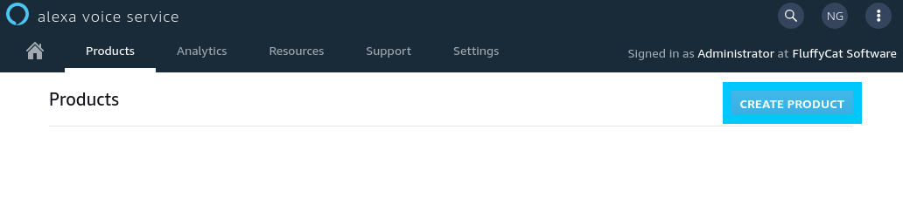

# Alexa Gadget - Cat Feeder

## Create Alexa Gadget Product

To start with we will need to create a new Alexa Voice Service Gadget by heading over to the [products portal](https://developer.amazon.com/alexa/console/avs/products). Click **Create Product** to begin.



Next you will be prompted to fill out a bunch of details about your new product. In our case we use the following details, however for your scenario feel free to change it up.

***NOTE**: The important piece of info is you MUST select Alexa Gadget as the product type.*

* **Product Name**: DevOpStar Cat Feeder
* **Product ID**: devopstar-cat-feeder
* **Product Type**: Alexa Gadget
* **Product Category**: Novelty Device
* **Product Description**: Smart Home cat feeder that will refill food bowls on request.


Once created, select your new product and take down the following information from the top:

* **Amazon ID**: A30XXXXXXXXXXX
* **Alexa Gadget Secret**: 4B4DXXXXXXXXXXXXXXXXXXXXXXXXXXXXXXXXXXXXXXXXXXXXXXXXXXXXXXXXXXXX


Keep this information safe as we'll be using it in the next step when we setup the Raspberry Pi.

## Register Raspberry Pi Gadget

In this step we will configure our Raspberry Pi as a registered Alexa Gadget. This process will require you to have the following pre-setup.

* **Raspberry Pi 3 B+**: Setup with Rasbian preferably.
  * Remote access either via VNC or SSH
  * `git` installed (*sudo apt install git*)

Connect to the Raspberry Pi, in my case I'm using `ssh` by running the following:

***NOTE**: you might need to replace `raspberrypi.local` with the IP address of the Pi on your network. same goes with the username `pi` if you changed it.*

```bash
ssh pi@raspberrypi.local
```

Pull down the [alexa/Alexa-Gadgets-Raspberry-Pi-Samples](https://github.com/alexa/Alexa-Gadgets-Raspberry-Pi-Samples) GitHub repository by running the following command from the home directory on the Raspberry Pi. Once cloned we will also change directory into the folder.

```bash
# Clone repo
git clone https://github.com/alexa/Alexa-Gadgets-Raspberry-Pi-Samples

# Change directory
cd Alexa-Gadgets-Raspberry-Pi-Samples
```

Within the folder there is a `launch.py` file that we will be running in order to configure the gadget with the authorization we created earlier.

```bash
sudo python3 launch.py --setup
# +--------------------------------------------------------------------+
# |    .oooooooo.                888                                   |
# |   d8P'    'Y8b     .oooo.    888   .ooooo.  oooo    ooo  .oooo.    |
# |  888        888   'P  )88b   888  d88' '88b  '88b..8P'  'P  )88b   |
# |  888        888    .oP'888   888  888ooo888    Y888'     .oP'888   |
# |  '88bb    dd88'   d8(  888   888  888    .o  .o8''88b   d8(  888   |
# |   'Y8bb,ood8P'    'Y888888o  888o 'Y8bod8P' o88'   888o 'Y888888o  |
# +--------------------------------------------------------------------+

# Do you want to configure all examples with your Alexa Gadget credentials (y/n)? 
y

# Enter the Amazon ID for your gadget:
A30XXXXXXXXXXX

# Enter the Alexa Gadget Secret for your gadget:
4B4DXXXXXXXXXXXXXXXXXXXXXXXXXXXXXXXXXXXXXXXXXXXXXXXXXXXXXXXXXXXX
```

The process will go through and install / configure all the dependencies needed to run the Alexa Gadget service on the Pi. This includes but not limited to:

* protobuf
* Bluetooth (Low Energy)
* Python GPIO lib

***NOTE**: During the instllation you will be prompted to agree with the Terms and Conditions of the `bluez` package. you can do this by typing **AGREE** when asked to*

```bash
# The Alexa Gadgets Raspberry Pi launch script provided herein will retrieve the 'Bluez-5.50' package at install-time from third-party sources. There are terms and conditions that you need to agree to abide by if you choose to install the 'Bluez-5.50' package (https://git.kernel.org/pub/scm/bluetooth/bluez.git/tree/COPYING?h=5.50). This script will also enable you to modify and install the 'bluez-5.50' package to enable notification callbacks after reconnections to a paired Echo device. This is required for communication between your gadget and the Echo device over BLE. If you do not agree with every term and condition associated with 'Bluez-5.50', enter 'QUIT', else enter 'AGREE'.
AGREE
```

The last thing you will be asked is if you would like to run the communication transport in BT (Classic Bluetooth) or BLE (Bluetooth Low Energy) mode. Depedending on what Alexa device you have will dictact which mode to choose. [Here's a helpful list](https://developer.amazon.com/en-US/docs/alexa/alexa-gadgets-toolkit/understand-alexa-gadgets-toolkit.html#devices) of devices and their support you can refer to.

```bash
# Which transport mode would you like to configure your gadget for (ble/bt)?
ble
# +------------------------------+
# |            SUCCESS           |
# +------------------------------+
```
